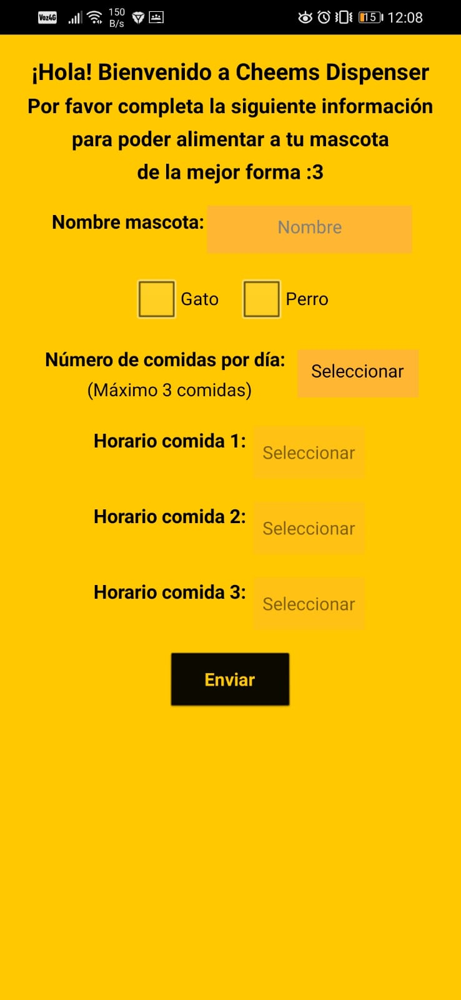
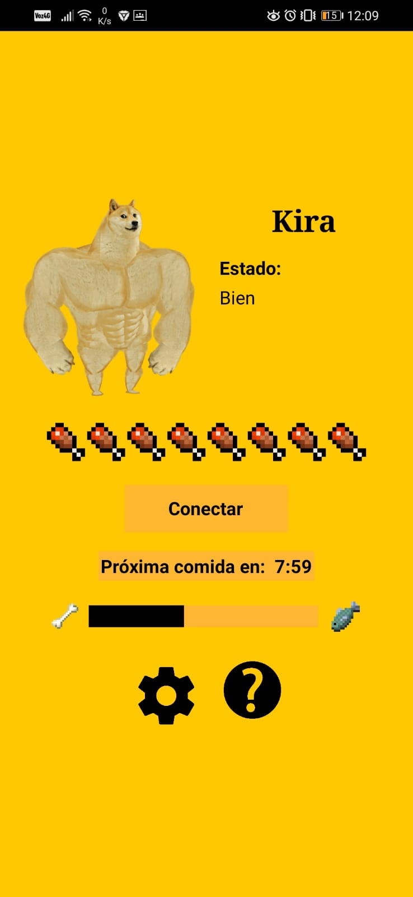
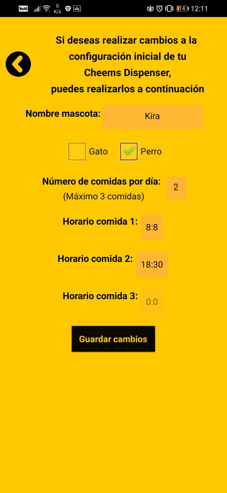
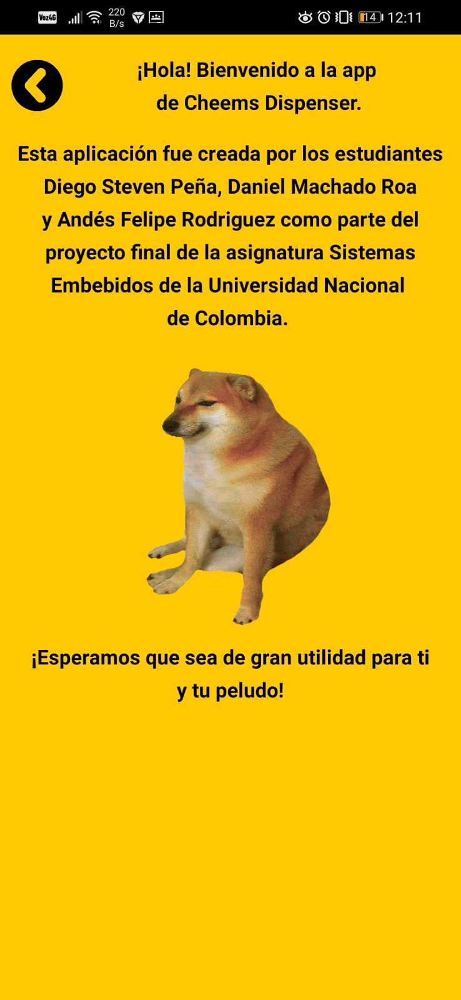

# APP :calling:
Se diseñó una aplicación móvil por medio de la plataforma APPInventor, la cual permite al usuario programar el número de comidas por día y el horario correspondiente. De igual forma el usuario, haciendo uso de la aplicación, podrá observar el estado de la mascota junto a la hora y el tiempo restante para la próxima comida.

## Viaje del usuario en la APP

### Screen de Carga

Al momento de iniciar la aplicación, el usuario observa en primer lugar la screen de carga. 

  

### Registro

La primera vez que el usuario ingresa a la app, deberá completar los datos requeridos para personalizarla especificando el tipo de mascota, su nombre, el número de comidas y  horario correspondiente; esto por medio de la screen de registro. 

  

### Menú principial 

En esta screen el usuario tendrá conocimiento del apetito de la mascota, además del tiempo restante para la próxima comida. De igual forma, por medio de esta screen el usuario podrá acceder a la screen de configuraciones y a la screen de información.

  

### Configuraciones

La aplicación le permitirá al usuario modificar los datos de personalización ingresados inicialmente en la screen de registro.

  

### Información 

En esta screen se indíca la información de los desarroladores de la aplicación y en general del dispensador de comida. 

  

