# Ensamble

## Ensamble - Tarjeta, Perifericos y Caja

El ensamble de todas las partes del dispositivo se realizo de la siguiente manera:

- En primer lugar despues de juntar y pegar cada una de las piezas de madera de la caja, se emplearon dos visagras para que la tapa superior de la caja fungiera como puerta, lo que permitiera acceder a cada uno de los compartimientos cuando se necesitara suplir con comida el dispensador.

  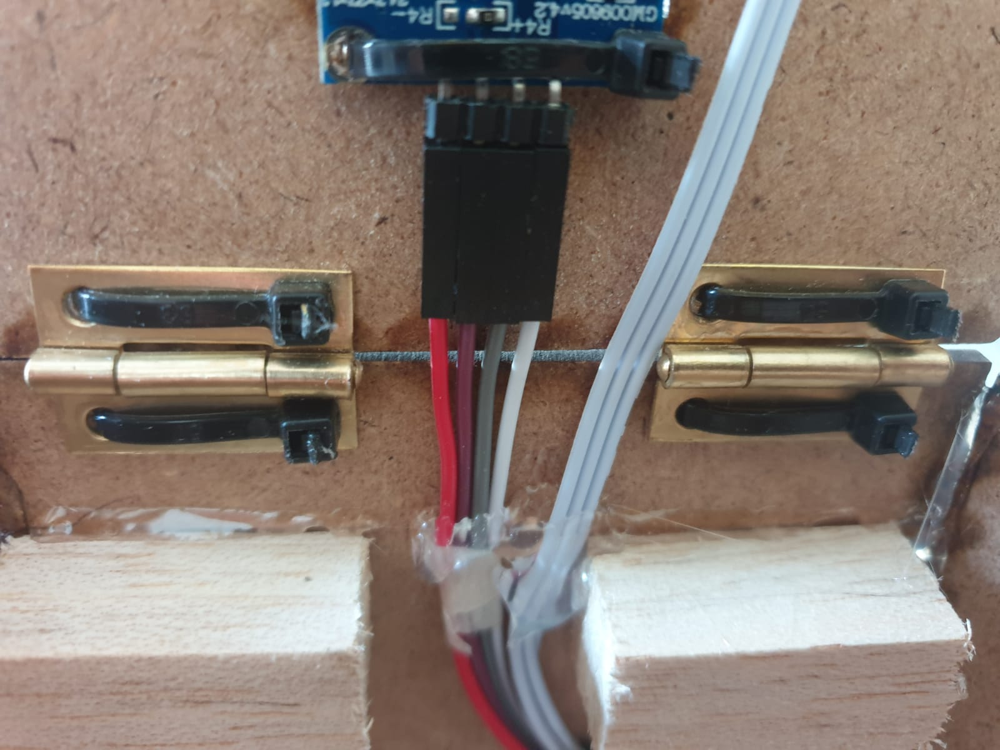

- El regulador de 3V3 se tendia a sobre-calentar, por lo tanto fue necesario implementar un disipador de calor de aluminio sobre este componente, lo que posterior a las pruebas se pudo notar que su temperatura se disipaba perfectamente.

  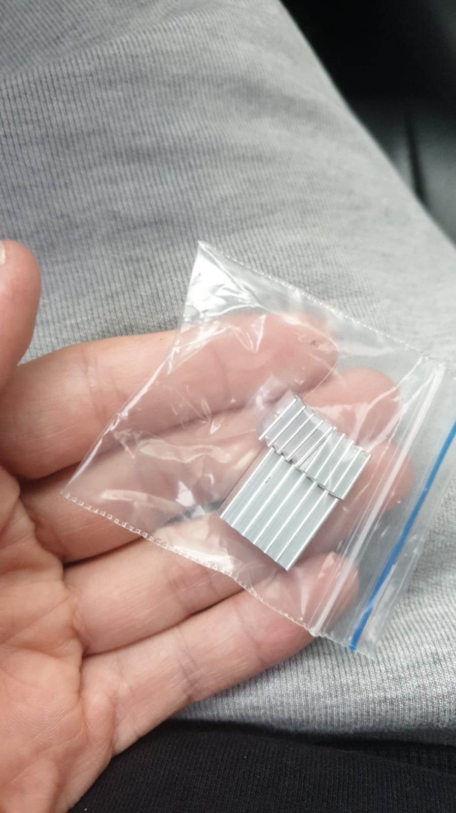

- Luego nos dimos cuenta que no habia suficiente grosor para ajustar la tarjeta del proyecto con tornillos de sujecion a la base de la caja, por lo tanto se decidio  colocar 3 soportes de madera que impidieran que la tarjeta se moviera de su lugar.

  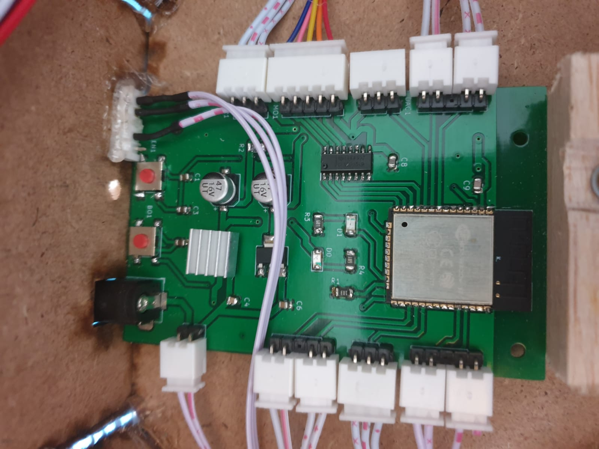

- Posteriormente se instalo el motor paso a paso, con dos soportes de madera que permitieron ajustarlo por medio de tornillos a la base de la caja.

  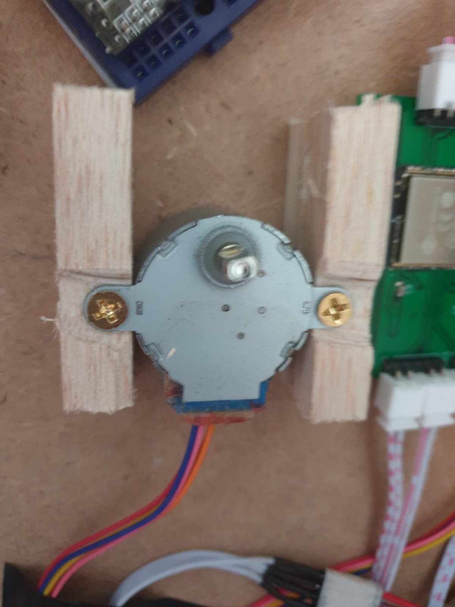

- Con respecto al OLED y el infrarrojo, se instalaron en la tapa del dispositivo ya que facilita tanto su visibilidad como su funcionalidad.

  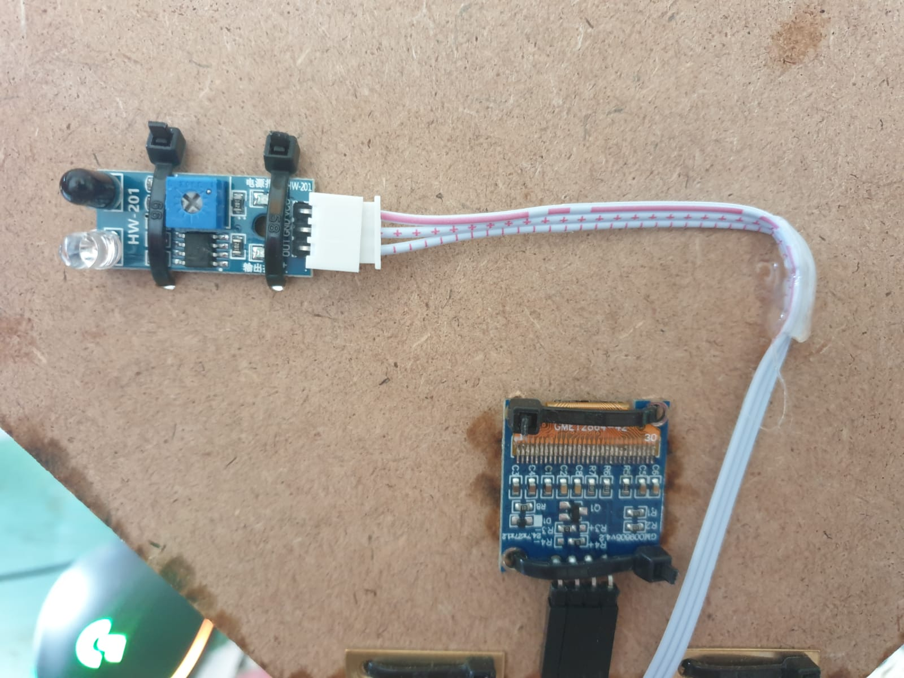

- El sensor PIR se instalo en la parte frontal del dispositivo ya que sera el encargado de detectar el movimiento y si la mascota se acerco al dispositivo a comer.

  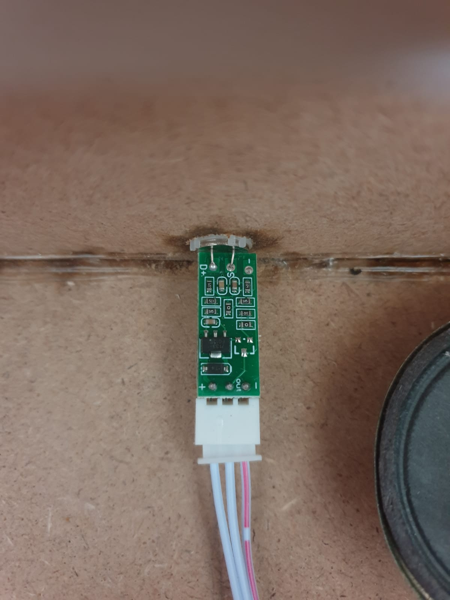

- El reproductor de audio DFP y el parlante se ubicaron en la zona del motor, procurando que el parlante no se acercase a la tarjeta para no inducirr interferencia.

  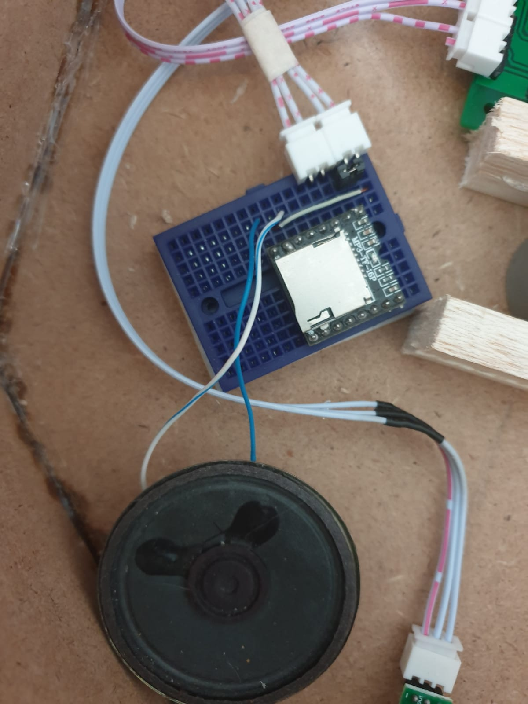

- Sobre el motor paso a paso se instalo un plato desechable con un base de madera para que se ajustara al rotor del motor y pudiera girar.

  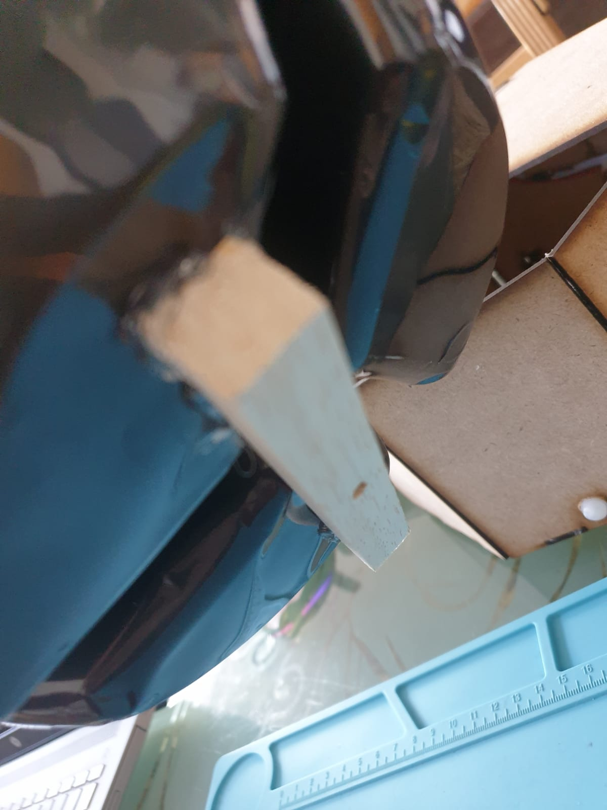

- Sobre una de las paredes de la caja se instalo un switch, para prender y apagar la tarjeta a voluntad.

  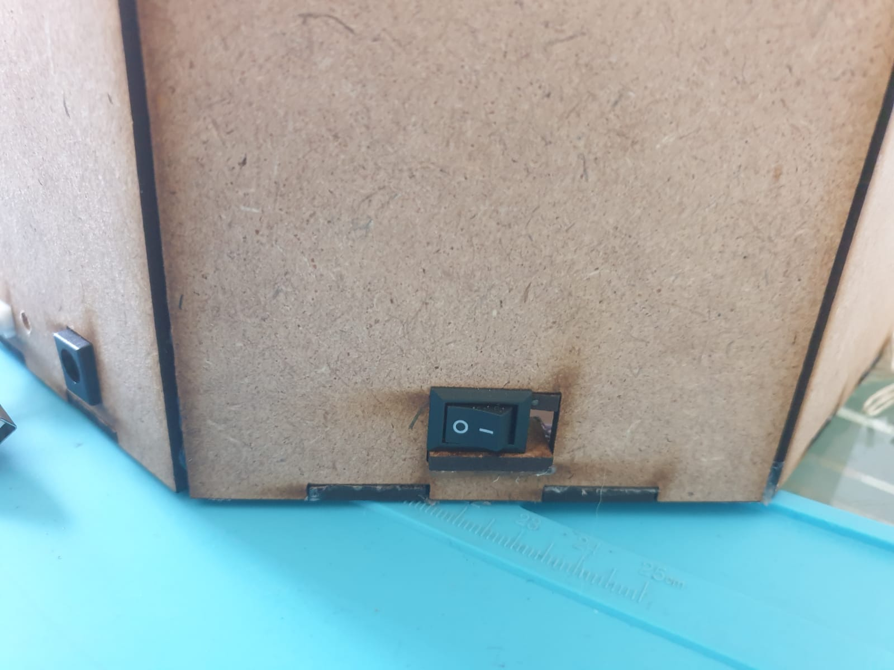

- Sobre las paredes de la caja se pusieron soportes de madera para que el plato pudiese descansar sobre estos y mantuviera una posicion horizontal a lo largo de su movimiento.

  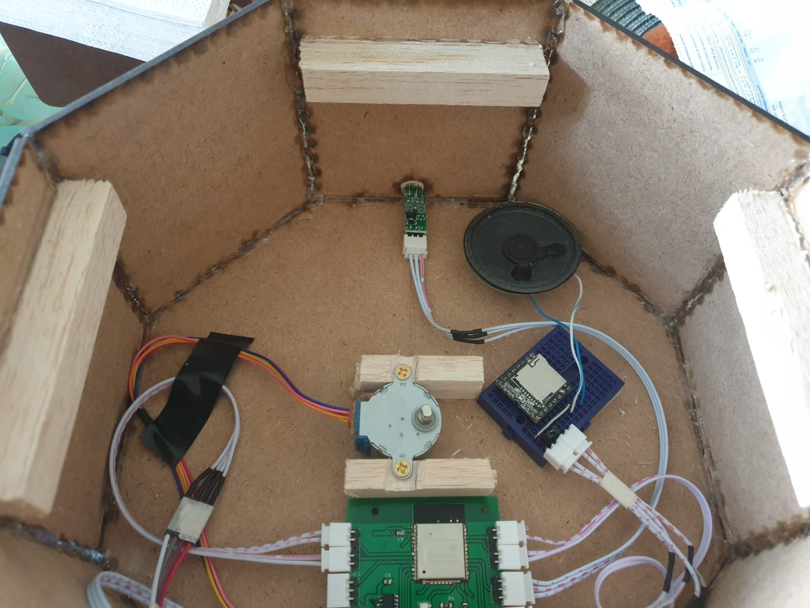

### Resultado del montaje

  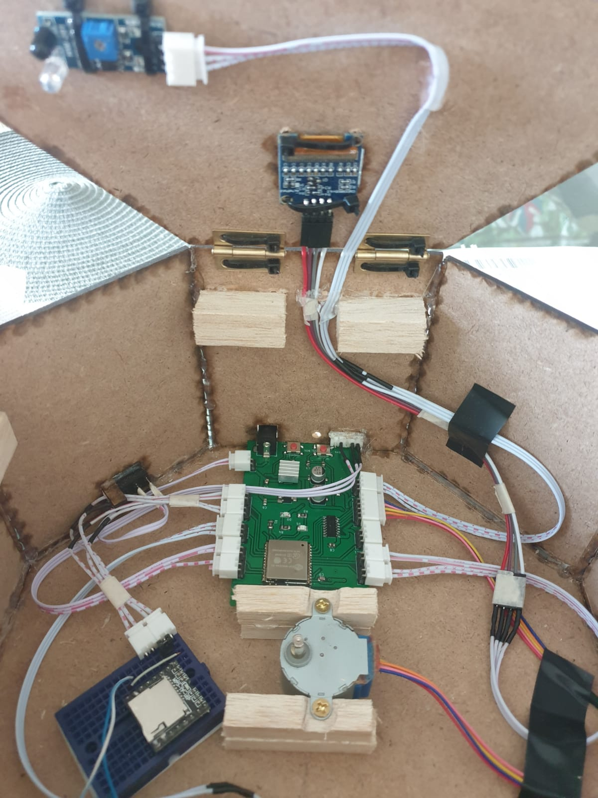

## Firmware y Hardware

Como se explica en el repositorio, el metodo para subir cada una de las piezas de codigo al ESP32 se realiza por medio de comunicacion serial por su periferico UART0, por lo tanto para simplificar el proceso de programacion se decidio poner una salida para pines en una pared de la caja. De este modo no habia que retirar todo el montaje para hacer una simple conexion a UART.

  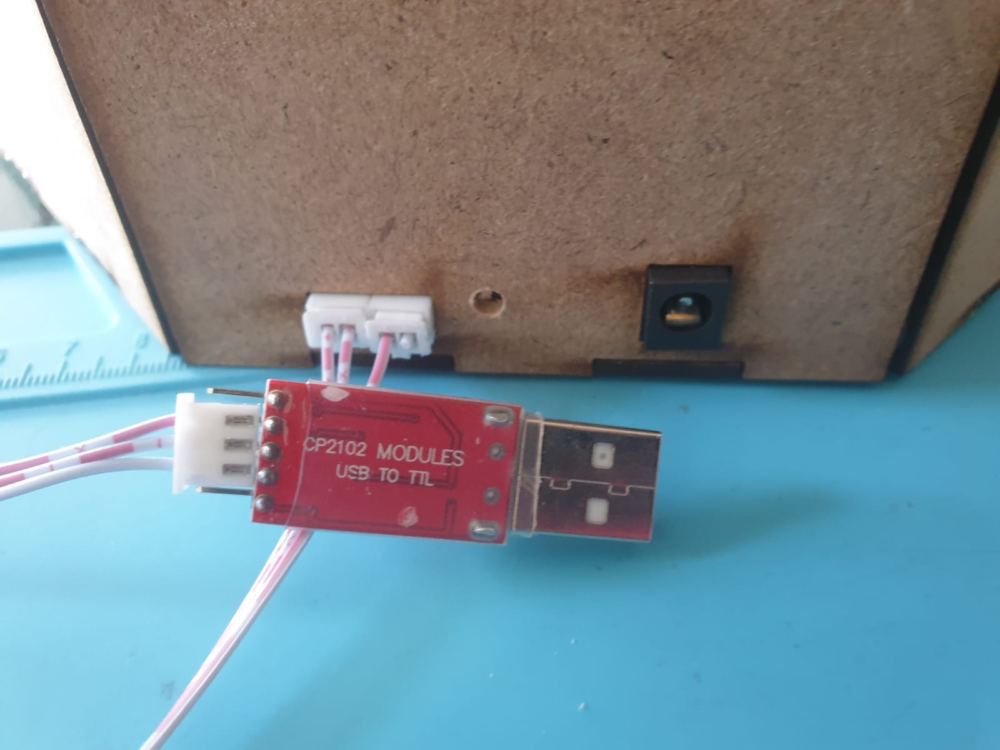

## Conexión ESP32 y App

La conexión entre el ESP32 y la app movil en el dispositivo del usuario se realiza por medio de un broker MSQQ, donde ambos dispositivos se suscriben a topicos especificos y publican o reciben mensajes según el proceso que se desée realizar.

### Conexión APP

Para llevar a cabo la conexión de la APP con el brocker, inicialmente se descarga la librería **UrsPahoMQTTClient** en APPInventor y por medio de la programación en bloques dentro de la plataforma y un botón en el main de la App se realizá la conexión al brocker. 

  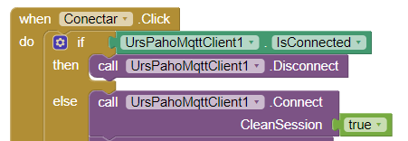

De igual forma, 

  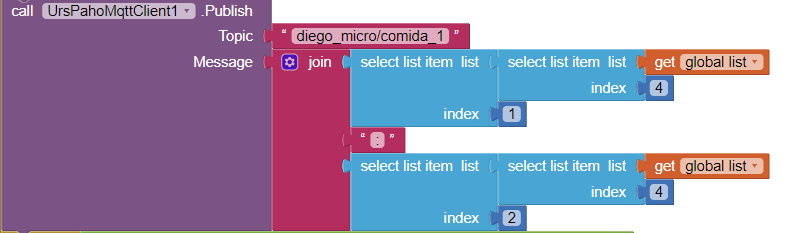

  

  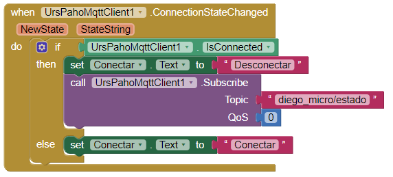

  

