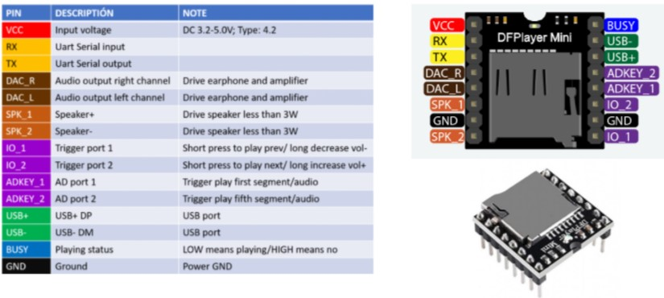

# DFPlayer Mini - Reproductor audio
La comunicación con el DFP player se basá que por el pin de TX (escritura) se envía una serie de 10 bytes las cuales estan organizados de la siguiente manera (para más informacion remitase a [DFPlayer](/Datasheets/DFP.pdf)):

| Byte | Descripción |
| ------------- | ------------- |
|  $$ | Para comenzar la comunicación y que el DFP player sepa que se estan comnicando con él |
| VER | La version (siempre la manejamos como FF) |
| Len | numero de bytes luego de esta posición |
| CMD | Comando que le quiere enviar al DPF player  |
| Feedback | Si se quiere saber retroalimentación del proceso que este haciendo |
| parm1 | Parametro 1 para dar una orden  |
| parm2 | Parametro 2 para dar una orden  |
| checksum | Suma y verificación de los valores que se van a enviar |
| $O | Byte final que dice que se termino la orden enviada |

De esta manera,para usar y dar ordenes al DFP player se usó una función llamada **sendInfo()** con la cual solo modificamos los valores de **CMD**, **parm1** y **parm2** para reproducir un audio, parar el audio, subir el volumen y demás. 

  

Pasando a las conexiones del DFP player se usó el pin VCC para la alimentación de 5v, los pines RX y TX como se mencionó anteriormente irían conectados al ESP32 para la comunicación con la Uart y el manejo del periférico, el pin GND como la tierra y por ultimo el DFP player posee un espacio para almacenar una memoria SD la cual posee los audios utilizados en el proyecto. Estos audios son nombrados como 0001, 0002... Esto dado que al ingresar el **parm2** dentro de la orden del DFP player pueda encontrar y reproducir el audio.

## Adecuacion

Como se indicó previamente el DFPlayer mini se comunica con el microcontrolador por medio de UART, por lo que se reserva la UART2 exclusivamente para la comunicación con el DFP. Y no es necesario realizar más adecuaciones o acondicionamientos para el DFPlayer, más allá de los pines de alimentación y tierra que necesita.

- 2 pines UART2.
- 1 pin Vcc de 3V3.
- 1 pin de GND.
