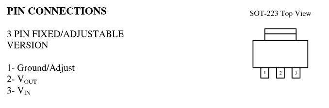
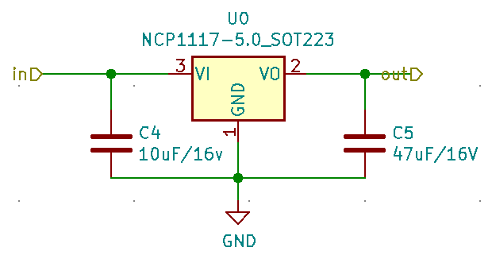
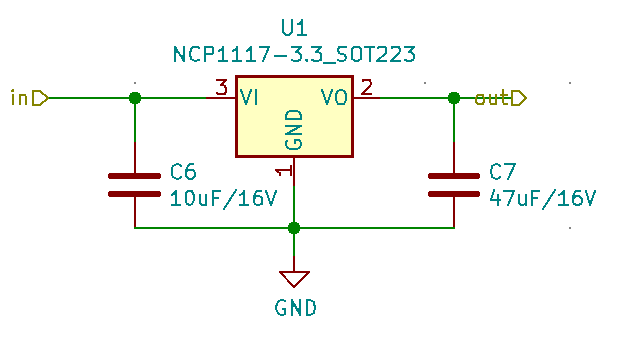

# Regulación de tension

El proyecto se utiliza un ESP32-WROOM, este necesita una tension de 3.3V para funcionar y por otro lado se necesitan 5V para poner en funcionamiento un motor paso a paso que se encargara de las prestaciones mecanicas del dispositivo. Por lo tanto se implementan dos reguladores de tension en la tarjeta que se desarrolle.
Con el fin de regular la tensión a 3.3 V y 5 V, se utilizan reguladores NCP1117-3.3 y NCP1117-5 con el empaquetado SOT-223.

  

## Diagrama de conexiones
Es importante identificar los pines de cada uno de los empaquetados para el correcto montaje sobre el circuito impreso, asi como el acondicionamiento que es necesario darles para su correcta implementacion.

  

## Adecuacion
Segun el datasheet es necesario utilizar capacitores de 10uF y 47uF en la entrada y la salida correspondientemente, para cada una de las configuraciones de los reguladores de montaje SMD que se utilizaran en el circuito impreso. 

  

  

