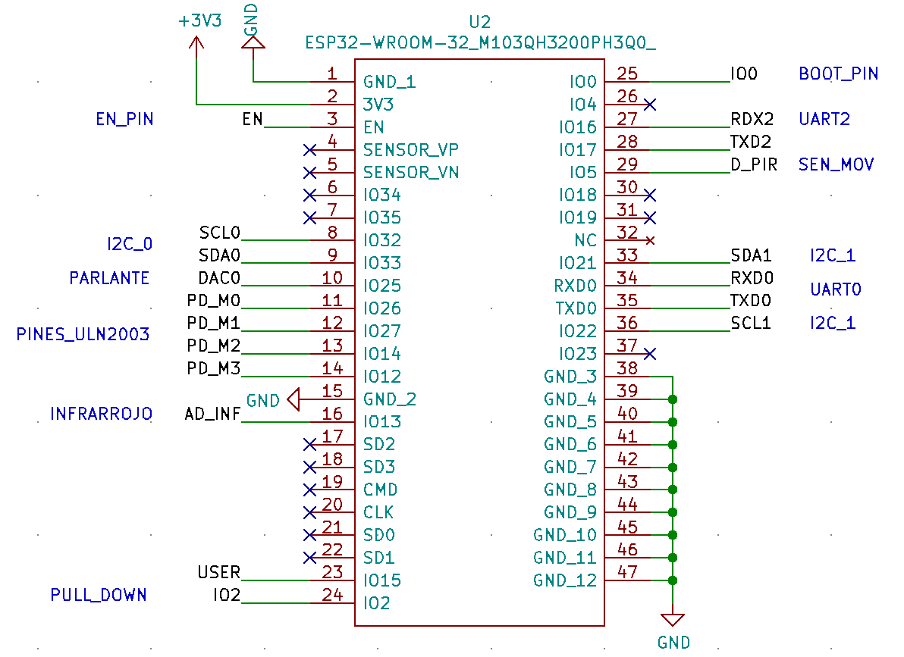
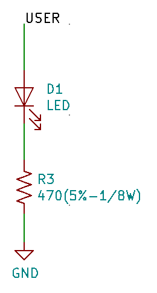
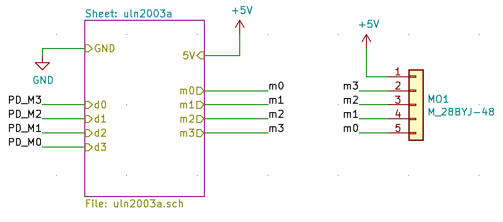
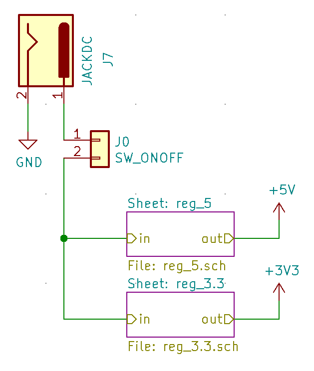
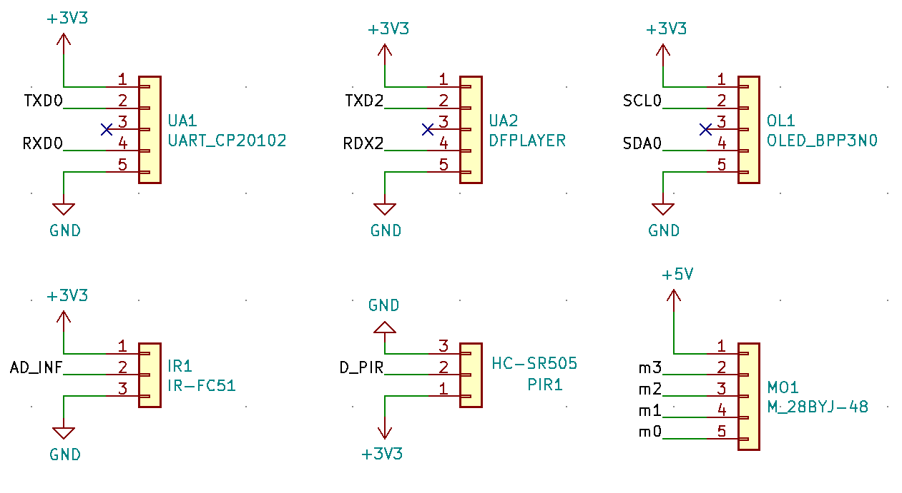

# Circuito Impreso
El circuito impreso se desarrolla teniendo en cuenta las adecuaciones y acondicionamientos que necesitan tanto el ESP32, los reguladores de tension y los perifericos. Para el desarrollo del esquematico y la PCB se utilizo el software de kiCAD, al cual fue necesario adicionarle las librerias correspondiente al esquematico del ESP32-WROOM y el footprint para la PCB.

## Esquematico - KiCAD
Despues de realizar el analisis de los distintos componentes y de los acondicionamientos necesarios, se realizo el esquematico en KiCAD de todo el proyecto. Incluyendo otras partes necesarias en hardware para la sujecion y conexion del sistema embebido. Igualmente dentro del repositorio se incluye el archivo del esquematico al cual puede remitirse para verificar todo lo diseñado [carpeta de circuito impreso](/CircuitoImpreso). 

### ESP32-WROOM
- Conexiones en general del microcontrolador.

  

- PIN USER: Este Pin se utiliza para interactuar visualmente con el ESP32 y verificar si funciona correctamente tanto la recepcion, como transmision de datos.

  

- PIN 2: Este Pin es importante que este en PULL-DOWN cuando el ESP32 se necesite que este en BOOT-MODE, por lo que se conecta una resistencia de 10kOhm para llevarlo a GND.

  

- PIN 0: Este Pin es de booteo, por lo tanto de acuerdo a lo recopilado de distintos repositorios, se requiere implementar un boton que al ser presionado ponga al PIN 0 en PULL-DOWN.

  

- PIN EN: Este Pin es el ENABLE, y tiene que estar en PULL-UP todo el tiempo. Sin embargo para cuando sea necesario resetear el ESP32 tiene que estar en PULL-DOWN. Por lo tanto se implementa un boton que realiza la misma funcion que el de Booteo y tiene la siguiente arquitectura.

  

- PIN 3V3: Se implementa un capacitor ByPass de 100pF para filtrar todo el ruido que pueda afectar la alimentacion del ESP32 (este capacitor se debe procurar que este lo suficientemente cerca de el pin 3V3).

  

  

### Motor paso a paso
- Configuracion del ULN2003 y caja negra del driver del motor paso a paso.

  

  

### Regulacion y conexion Jack-DC

- Acondicionamiento de reguladores

  

  

- Conexion Jack-DC para cargador de 12V, en donde se deja una salida para conectar un interruptor que permita apagar y prender el dispositivo.

  

### Conectores para los perifericos en general

  

## PCB - KiCAD
