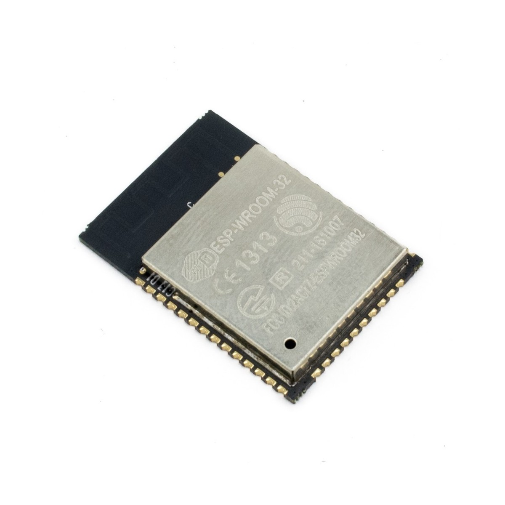

# Microcontrolador ESP32-WROOM

El microcontrolador ESP32 es un SoC basado en un procesador Xtensa LX6, el cual gracias a su hardware presta la funcionalidad de comunicacion inalambrica gracias a su modulo de WiFi y Bluetooth. Por lo tanto se decidio utilizar especificamente la version ESP32-WROOM del mismo ya que se acomodaba justamente a las necesidades de hardware que se requerian para el funcionamiento del dispositivo dispensador de comida para mascotas.

  

El ESP32-WROOM32 cuenta con 38 pines de los cuales se emplearan UART's, pines digitales y analogicos. Para mas informacion sobre la descripcion de los pines remitirse a [esp32wroom](/Datasheets/esp32-wroom-32_datasheet_en.pdf).

## Adecuacion

Si bien el SoC del ESP32-WROOM viene con la adecuacion de sus perifericos internos y los modulos que implementa para funcionar. Es necesario realizar la adecuacion de este por medio de una serie de resistencias y capacitores para poderlo trabajar correctamente en la practica. Muchos de los acondicionamientos que se van a listar aqui pueden funcionar para cualquier ESP32, sin embargo cabe resaltar que se realizan para el ESP32-WROOM (para mas informacion remitase a [Ajustes para correcto funcionamiento de esp32](/Datasheets/)).

- Pin 2: 

## Programacion 
